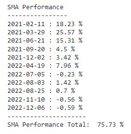
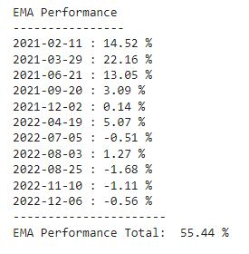

# TradingStrategy

- The goal is this project is to select short and long moving averages that a financial operator would use to advertise on buying/selling stock or to invest using a short/long strategy.

- Although EMA is optimal for short term trades, SMA become more reliable by confirming trends for mid - longer positions

 

- AAPL

 

- AMD

 

- AMZN

 

- GME

 

- NFLX

 

