# TradingStrategy

- The goal is this project is to select short and long moving averages that a financial operator would use to advertise on buying/selling stock or to invest using a short/long strategy.

- Although EMA is optimal for short term trades, SMA become more reliable by confirming trends for mid - longer positions

- AAPL
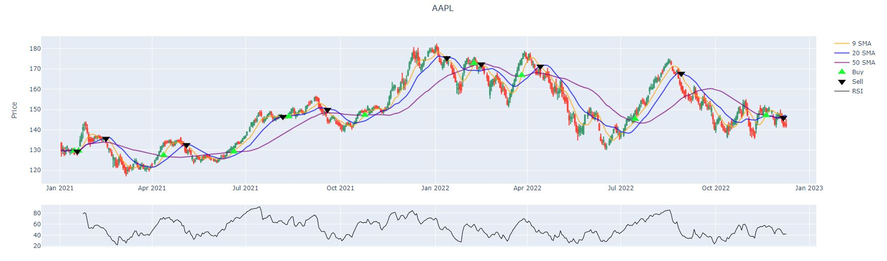
- AAPL Performance
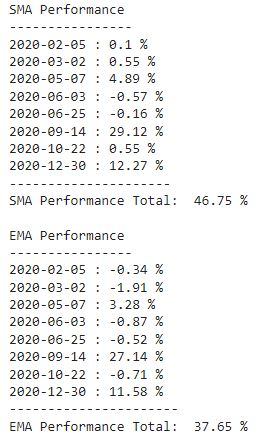
- AMC

- AMC Performance
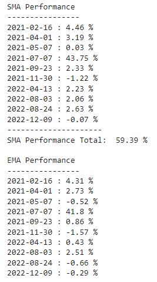
- AMD
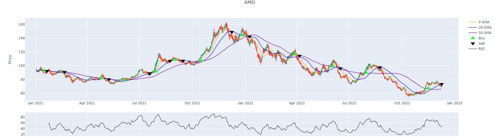
- AMD Performance
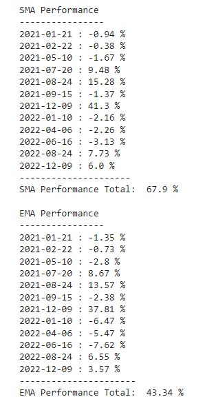
- AMZN
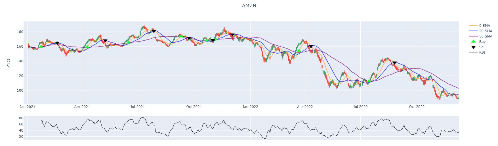
- AMZN Performance
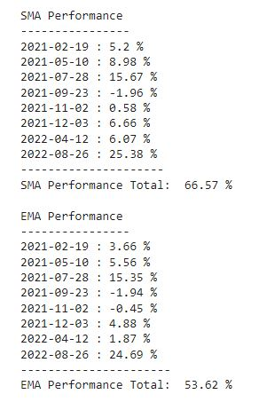
- GME
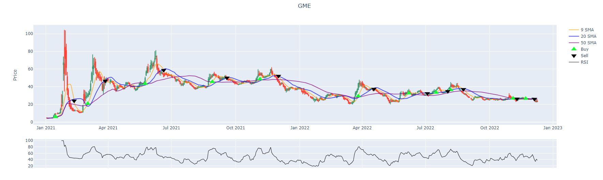
- GME Performance

- NFLX
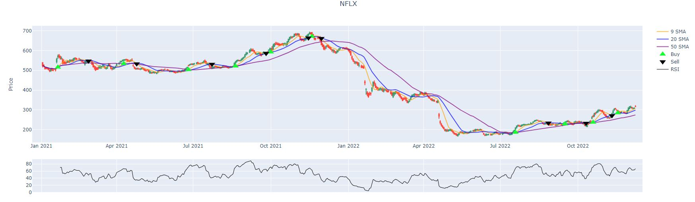
- NFLX Performance
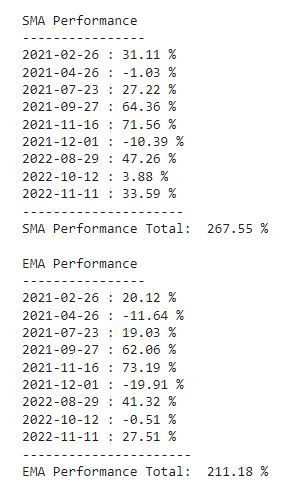
- TSLA

- TSLA Performance
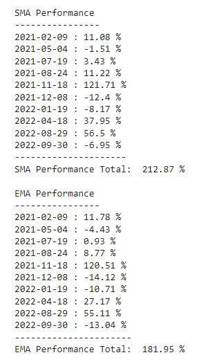

