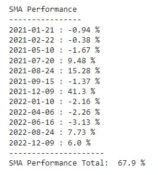

# TradingStrategy

- The goal is this project is to select short and long moving averages that a financial operator would use to advertise on buying/selling stock or to invest using a short/long strategy.

- Although EMA is optimal for short term trades, SMA become more reliable by confirming trends for mid - longer positions

- AAPL

- AAPL Performance

 

- AMD

- AMD Performance

 

- AMZN

- AMZN Performance

 

- GME

- GME Performance

 

- NFLX

- NFLX Performance

 

